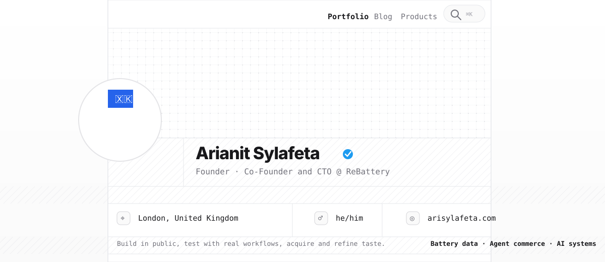

<p align="center">
  <a href="https://arisylafeta.com">
    
  </a>
</p>

<p align="center">
  <a href="https://arisylafeta.com"></a>
  <a href="https://github.com/arisylafeta"></a>
  <a href="https://www.linkedin.com/in/arianitsylafeta"></a>
</p>

<p align="center">
  
</p>

## About

- I am currently CTO at **ReBattery**.
- I help make the battery market more liquid by applying a technical lens to battery data and customer transactions.
- I enjoy turning complex ideas into clear product experiences, from prototype to production.
- My interests include energy markets, agent commerce, and AI organizational management.
- Outside work, I spend time on chess and Brazilian jiu-jitsu.

## Focus

```txt
role          Founder · Co-Founder and CTO @ ReBattery
location      London, United Kingdom
portfolio     https://arisylafeta.com
current arc   battery market infrastructure, AI systems, agent commerce
```

## Products

| Product | Positioning | Link |
| --- | --- | --- |
| **ReBattery** | Battery market infrastructure, built for liquidity. | [Open](https://rebattery.io/) |
| **EasyClaw** | Open-source agents, cloud-simple deployment. | [Open](https://easyclaw-navy.vercel.app/) |
| **Reoutfit** | Try on the future of e-commerce styling. | [Open](https://www.reoutfit.me/) |
| **Salespeak** | Pipeline growth, engineered for modern sales teams. | [Open](https://salespeak-seven.vercel.app/) |
| **20Punches** | AI investing copilots for clearer market decisions. | [Open](https://www.20punches.co.uk/) |

## Stack

<p>
  
</p>

## Selected Repositories

| Repository | Why it matters |
| --- | --- |
| [`minimal-openclaw`](https://github.com/arisylafeta/minimal-openclaw) | Lightweight self-hosted agent/dev environment wiring. |
| [`image2asset`](https://github.com/arisylafeta/image2asset) | Image-to-3D asset workflows and gallery export tooling. |
| [`reddit-analyzer`](https://github.com/arisylafeta/reddit-analyzer) | Turning community conversations into useful signals. |
| [`langgraph-projects`](https://github.com/arisylafeta/langgraph-projects) | Agent orchestration experiments and graph-based workflows. |
| [`Monte-Carlo-Pricing`](https://github.com/arisylafeta/Monte-Carlo-Pricing) | Quant experiments with simulation-driven pricing. |

## GitHub Contributions

<p align="center">
  
</p>

<p align="center">
  
  
</p>

<p align="center">
  Build in public, test with real workflows, acquire and refine taste.
</p>
